# Frames + transcripción — ui-parametros

- **Video:** `tutorial-360p.mp4` (35.8 min)
- **Frames:** 12

Cada bloque es un momento del video: lo que se ve y lo que se dice ahí mismo.

---

### 2:45

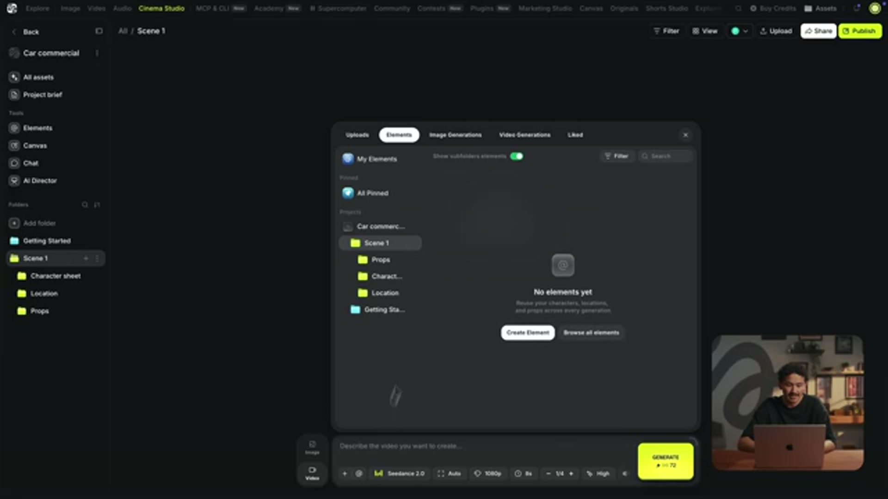

Every time I look an asset, I do two things. So in Higgsfield, I save it as an element with a name starting with at. This one is car sheet. Then I attach the same image into Claude and tell it the name. From now on Claude writes car sheet into its prompt and when I paste the prompt

---

### 3:40

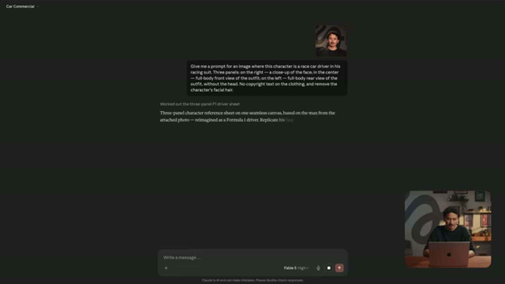

No copyright text on the clothing, and let's also remove the character's facial hair. Now Claude gave me a detailed prompt. I'm pasting it into Seedream Pro 5.0. It's one of the best models for outfits, especially when feeding in your own inputs.

---

### 4:35

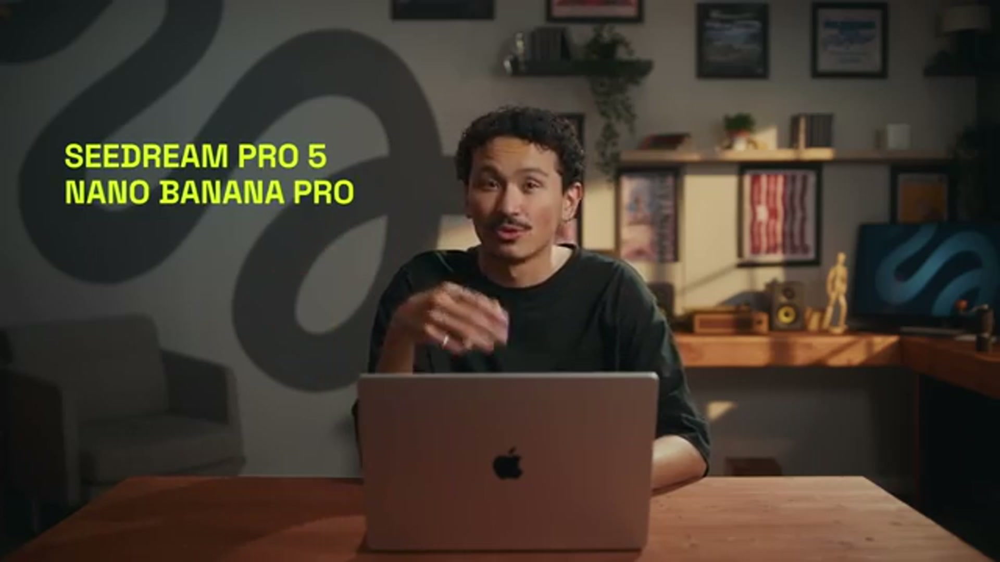

Claude gives me this prompt, now I want to test which model performs better here for editing the image, so I'm going to run the exact same prompt in Seedream Pro 5.0 and Nano Banana Pro. These two tend to work best at this. Alright, none of these came out how we wanted them to, if you look closely you'll notice that they all look too sloppy, the face is overly smoothed out, and the whole setting

---

### 8:55

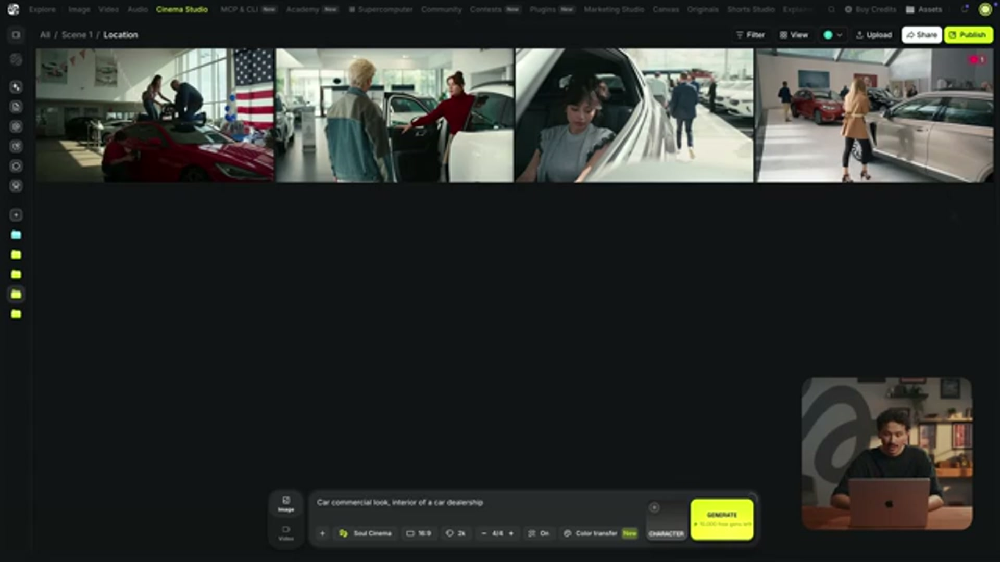

to nail the vibe and the colors first alright so this is the one I landed on for the vibe or commercial now watch this move in the image tab I'm gonna select soul cinema click color transfer and upload that image from now on every

---

### 9:05

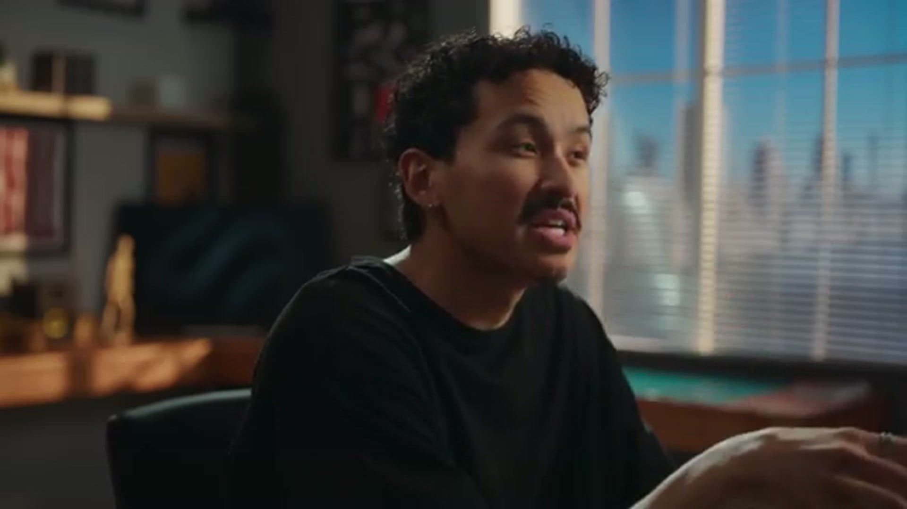

select soul cinema click color transfer and upload that image from now on every Every image I create pulls from that exact same palette. It's what keeps the whole film looking like one film. Let's head back to Claude and get more specific for the location.

---

### 9:40

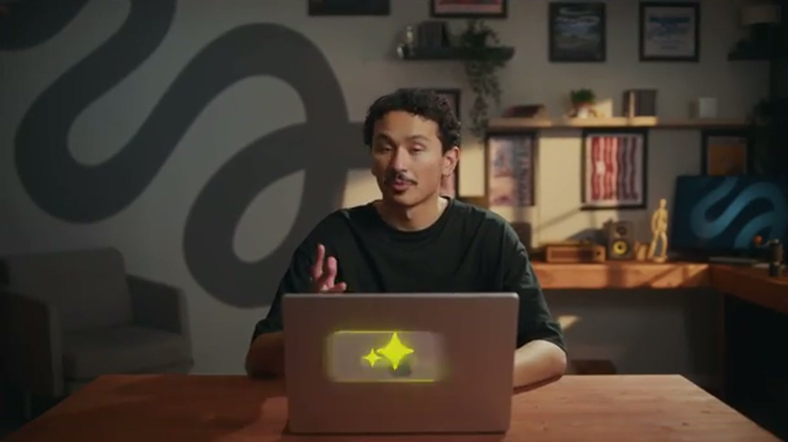

Same workflow, 30 seconds. and saving that in as a new element. I'm gonna leave the full prompt in the description. Alright we've locked all the assets for the scene, now for the fun part, generating videos. For this let's head over to Claude and upload the custom

---

### 10:05

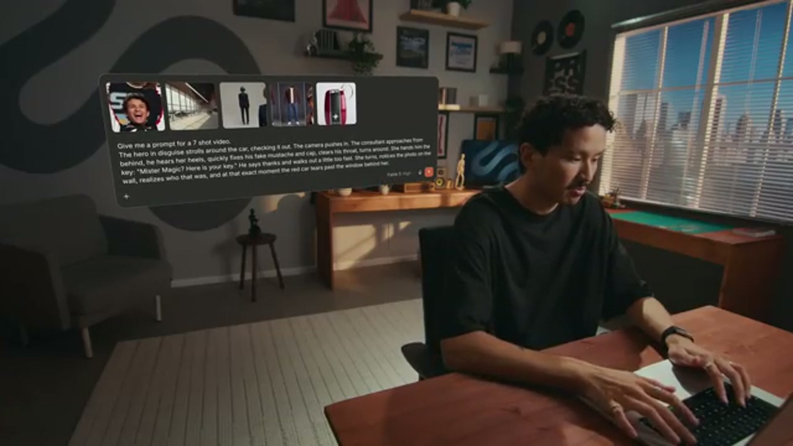

mind so I'm gonna spell it out beat by beat. First let's drop in all the assets that we've locked, and now the prompt. All right, let's take that prompt and generate. Okay, the very first prompt turned out a lot better than I expected. Don't get me wrong, quite a few things still broke here,

---

### 12:30

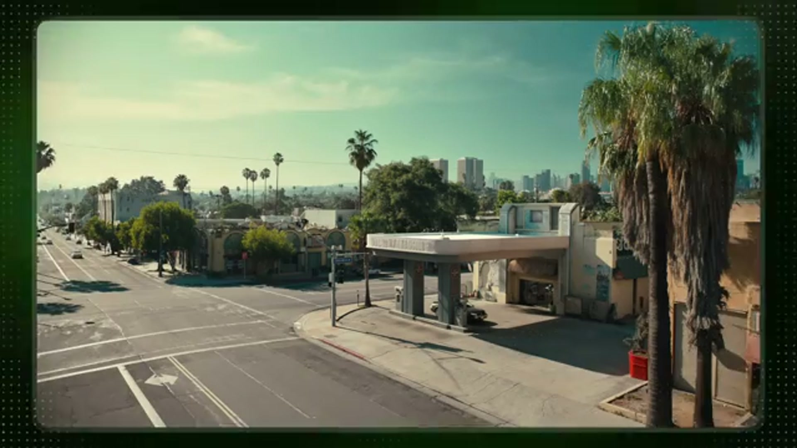

before you generate a single video. So in my case I removed the text in one edit pass, then after my first video tests I also discovered a second problem. So the cars in the distance kept morphing into clones of our red car. I edited those out too, two passes, now we have a

---

### 16:20

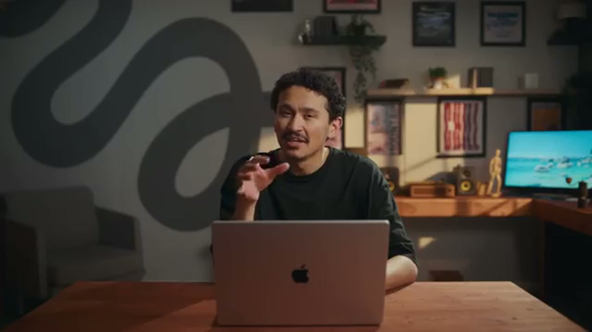

That's a lot for one generation and I knew it, so at the end of my request I added one line. If this is too much for one prompt, split it in two, and Claude split it. And notice two things in there. That image 1 reference, that's the parked car screenshot from the statics video. The position lock doing its job.

---

### 21:10

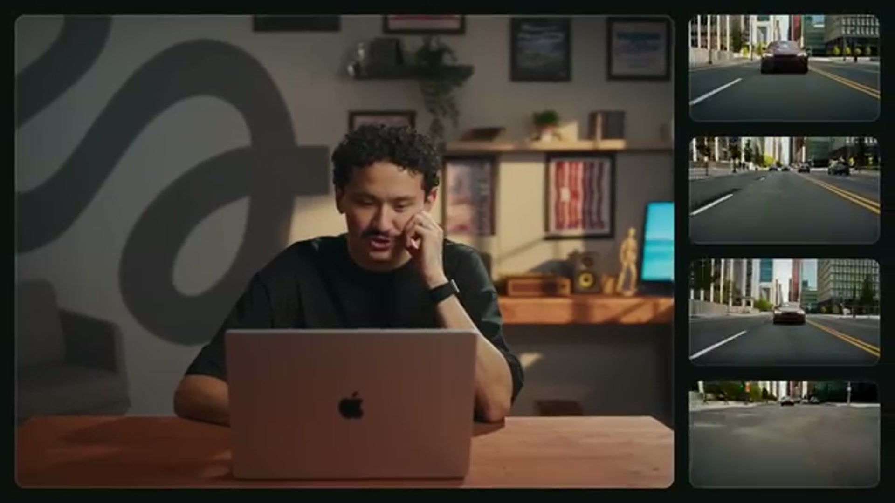

Oh yeah, completely different story. So a ton of unique shots to work with. And that's the move for any dynamic sequences. Generate multi-shot, batch a ton, and cut the best parts together.

---

### 26:40

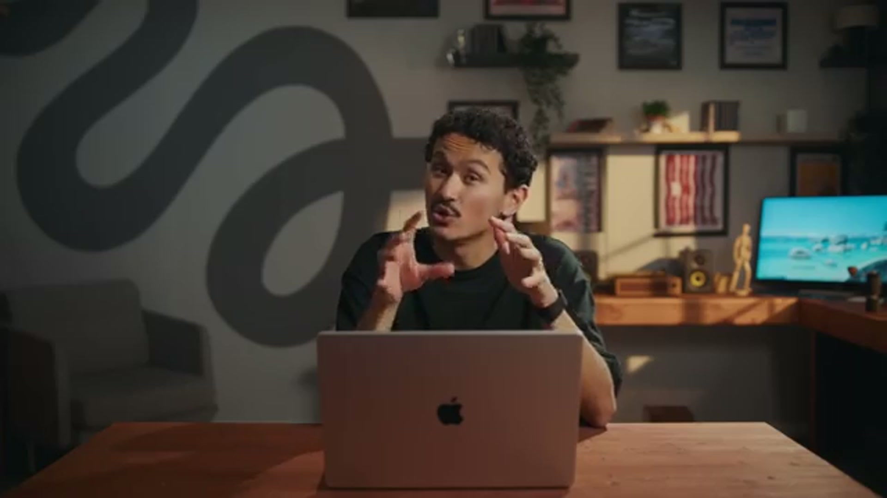

from this generation, now the punchline. The car blasts through the checkpoint without stopping, and we meet two toll controllers who watch it happen. Two new characters, same character sheet workflow. So speedrun, controller 1, 45 to 55, a warm, characterful face, gray uniform, peaked cap,

---

### 31:05

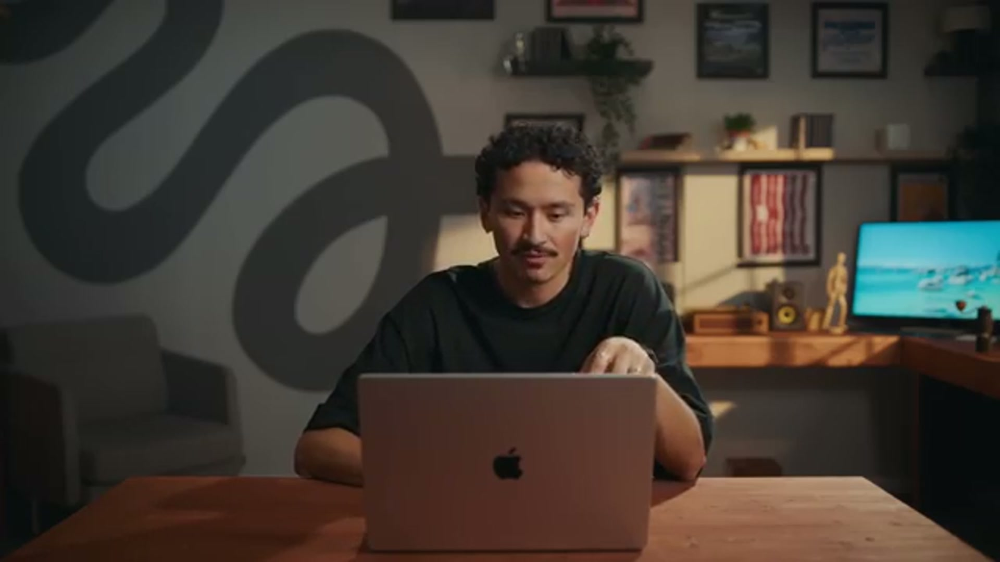

There we go. I'm taking the girl from one generation and the hero from the other. The blocking and car position worked really well even with such a complex location like the airport with a ton of tiny details.

---
